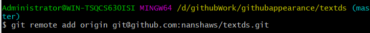
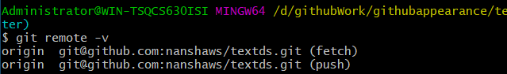
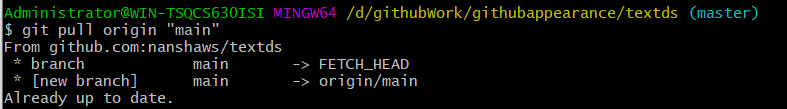

# git的常用命令使用

## 1.git与远程github搭建ssh

1.先注册github账号

2.设置git的username和邮箱

set config --global user.name  “xxx”

set config --global user.email  “@qq.com”

3.查看是否配置好

```git
git config --global --list
```

4.配置SSH

```git
$ ssh-keygen -t rsa -C “your_email@youremail.com“
```

5.查看和配置

```git
cat ~/.ssh/id_rsa.pub
```

点击头像，打开个人设置--选择SSH公钥--新增公钥

## 2.git与远程仓库关联

1.命令关联

```git
git remote add origin git@github.com:yourName/repositoryname.git
git remote add origin https://github.com/yourName/repositoryname.git

```

yourName是用户名，repositoryname是仓库名字



2.查看是否成功关联

```git
git remote -v
```



3.从远程拉项目

```git
git pull origin "分支名"
例如：git pull origin "main"
```



4.查看状况

```git
git status
```

5.添加add

```git
 git add README.md
```

6.提交commit(加括号的不写)

```git
$ git commit -am "gitHelpAdd" (备注)
```

7.查看分支

```git
git branch
```


8.将本地文件push到远程仓库

```git
git push origin master
```


## 3.将github项目换为最新的
